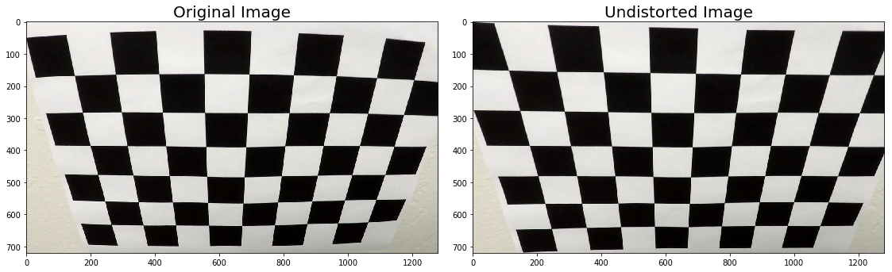
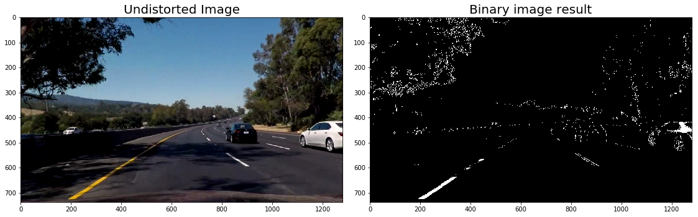
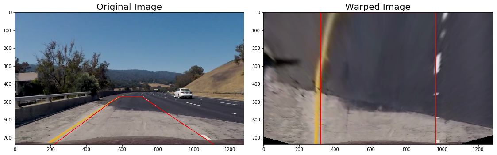
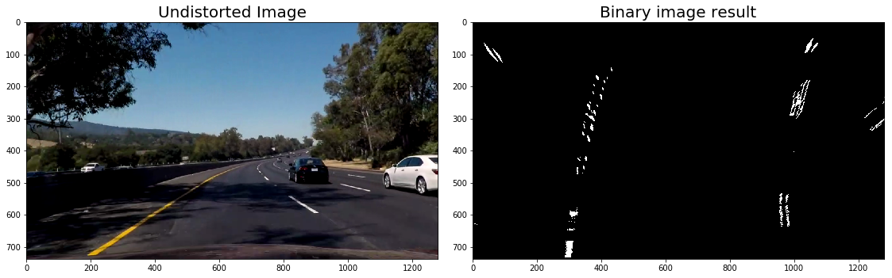
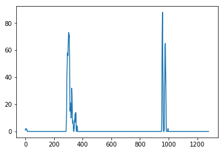
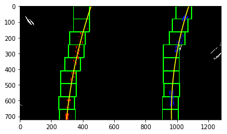
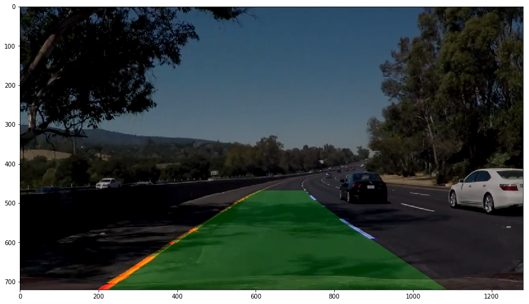
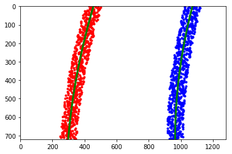
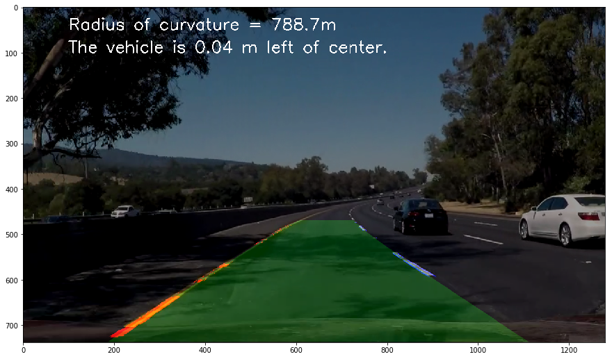

## Advanced Lane Finding Project

The goals / steps of this project are the following:

* Compute the camera calibration matrix and distortion coefficients given a set of chessboard images.
* Apply a distortion correction to raw images.
* Use color transforms, gradients, etc., to create a thresholded binary image.
* Apply a perspective transform to rectify binary image ("birds-eye view").
* Detect lane pixels and fit to find the lane boundary.
* Determine the curvature of the lane and vehicle position with respect to center.
* Warp the detected lane boundaries back onto the original image.
* Output visual display of the lane boundaries and numerical estimation of lane curvature and vehicle position.

---
## First, compute the camera calibration using chessboard images to get the corners, use corners as the objpoints as the 2d points in the images plane, and use np.mgrid as the 3d points in real world space

```python
objp[:,:2] = np.mgrid[0:9,0:6].T.reshape(-1,2)
...
objpoints = [] # 3d points in real world space
imgpoints = [] # 2d points in image plane.
...
ret, corners = cv2.findChessboardCorners(gray, (9,6),None)
```

## Compute the matrix and distortion coefficients, and apply undistortion to a test images to check the effects

```python
ret, mtx, dist, rvecs, tvecs = cv2.calibrateCamera(objpoints, imgpoints, img_size, None, None)
dst = cv2.undistort(img, mtx, dist, None, mtx)
...
```





## Use color transforms, gradients, etc., to create a thresholded binary image
* use s_channel for saturation 
* use Sobel to caculate the sobelx
* use v_channel to get the value of the pixel

```python
    hls = cv2.cvtColor(img, cv2.COLOR_RGB2HLS)
    s_channel = hls[:,:,2]
    
    hsv = cv2.cvtColor(img, cv2.COLOR_RGB2HSV)
    v_channel = hsv[:,:,2]
    ...

    # Sobel x
    sobelx = cv2.Sobel(gray, cv2.CV_64F, 1, 0) # Take the derivative in x
    abs_sobelx = np.absolute(sobelx) # Absolute x derivative to accentuate lines away from horizontal
    scaled_sobel = np.uint8(255*abs_sobelx/np.max(abs_sobelx))

    # Threshold x gradient
    thresh_min = 50
    thresh_max = 100
    sxbinary = np.zeros_like(scaled_sobel)
    sxbinary[(scaled_sobel >= thresh_min) & (scaled_sobel <= thresh_max)] = 1

    # Threshold color channel
    s_thresh_min = 120
    s_thresh_max = 255
    s_binary = np.zeros_like(s_channel)
    s_binary[(s_channel >= s_thresh_min) & (s_channel <= s_thresh_max)] = 1
    
    # Threshold white
    white_thresh_min = 150
    white_binary = np.zeros_like(v_channel)
    white_binary[(v_channel >= white_thresh_min)] = 1
    
    combined_binary = np.zeros_like(sxbinary)
    combined_binary[((s_binary == 1) & (white_binary == 1) | (sxbinary == 1))] = 1
    return combined_binary

```





## Prepare src and dst points, calculate M, and apply a perspective transform to rectify test color image ("birds-eye view")


```python
src = np.float32(
    [[(img_size[1] / 2) - 60, img_size[0] / 2 + 100],
    [((img_size[1] / 6) + 5), img_size[0]],
    [(img_size[1] * 5 / 6) + 45, img_size[0]],
    [(img_size[1] / 2 + 65), img_size[0] / 2 + 100]])
dst = np.float32(
    [[(img_size[1] / 4), 0],
    [(img_size[1] / 4), img_size[0]],
    [(img_size[1] * 3 / 4), img_size[0]],
    [(img_size[1] * 3 / 4), 0]])
...
M = cv2.getPerspectiveTransform(src, dst)
warped = cv2.warpPerspective(road_img, M, (img.shape[1], img.shape[0]), flags=cv2.INTER_LINEAR)
```


## Apply a perspective transform to the binary image from previous step ("birds-eye view"), we can see the road lanes are transformed from 3D angle to bird view

```python
warped = cv2.warpPerspective(result, M, (img.shape[1], img.shape[0]), flags=cv2.INTER_LINEAR)
```



## After the binary image is warped, I summed up the pixels and use argmax to get initial lane positions

```python

histogram = np.sum(binary_warped[binary_warped.shape[0] // 2:, :], axis=0)
...
leftx_base = np.argmax(histogram[:one_third])
rightx_base = np.argmax(histogram[2*one_third:]) + 2*one_third
```

## Then calculate the windows and get the left and right nonzeros points as the left lane and right lane

```python
for window in range(nwindows):
    ...
    good_left_inds = ((nonzeroy >= win_y_low) & (nonzeroy < win_y_high) &
                      (nonzerox >= win_xleft_low) & (nonzerox < win_xleft_high)).nonzero()[0]
    good_right_inds = ((nonzeroy >= win_y_low) & (nonzeroy < win_y_high) &
                       (nonzerox >= win_xright_low) & (nonzerox < win_xright_high)).nonzero()[0]
    left_lane_inds.append(good_left_inds)
    right_lane_inds.append(good_right_inds)
    ...
```

## Fit polynomial to left and right lanes

```python
left_fit = np.polyfit(lefty, leftx, 2)
right_fit = np.polyfit(righty, rightx, 2)

# Generate x and y values for plotting
ploty = np.linspace(0, binary_warped.shape[0] - 1, binary_warped.shape[0])
# print(ploty)
print('left fit: ', left_fit)
print('right fit: ', right_fit)
left_fitx = left_fit[0] * ploty ** 2 + left_fit[1] * ploty + left_fit[2]
right_fitx = right_fit[0] * ploty ** 2 + right_fit[1] * ploty + right_fit[2]

out_img[nonzeroy[left_lane_inds], nonzerox[left_lane_inds]] = [255, 0, 0]
out_img[nonzeroy[right_lane_inds], nonzerox[right_lane_inds]] = [0, 0, 255]
plt.imshow(out_img)
plt.plot(left_fitx, ploty, color='yellow')
plt.plot(right_fitx, ploty, color='yellow')
plt.xlim(0, 1280)
plt.ylim(720, 0)
plt.show()

# ----------------------------------------------------
# Assume you now have a new warped binary image
# from the next frame of video (also called "binary_warped")
# It's now much easier to find line pixels!
nonzero = binary_warped.nonzero()
nonzeroy = np.array(nonzero[0])
nonzerox = np.array(nonzero[1])
margin = 100
left_lane_inds = ((nonzerox > (left_fit[0] * (nonzeroy ** 2) + left_fit[1] * nonzeroy +
                               left_fit[2] - margin)) & (nonzerox < (left_fit[0] * (nonzeroy ** 2) +
                                                                     left_fit[1] * nonzeroy + left_fit[2] + margin)))

right_lane_inds = ((nonzerox > (right_fit[0] * (nonzeroy ** 2) + right_fit[1] * nonzeroy +
                                right_fit[2] - margin)) & (nonzerox < (right_fit[0] * (nonzeroy ** 2) +
                                                                       right_fit[1] * nonzeroy + right_fit[
                                                                           2] + margin)))

# Again, extract left and right line pixel positions
leftx = nonzerox[left_lane_inds]
lefty = nonzeroy[left_lane_inds]
rightx = nonzerox[right_lane_inds]
righty = nonzeroy[right_lane_inds]
# Fit a second order polynomial to each
left_fit = np.polyfit(lefty, leftx, 2)
right_fit = np.polyfit(righty, rightx, 2)
# Generate x and y values for plotting
ploty = np.linspace(0, binary_warped.shape[0] - 1, binary_warped.shape[0])
left_fitx = left_fit[0] * ploty ** 2 + left_fit[1] * ploty + left_fit[2]
right_fitx = right_fit[0] * ploty ** 2 + right_fit[1] * ploty + right_fit[2]

# Create an image to draw on and an image to show the selection window
out_img = np.dstack((binary_warped, binary_warped, binary_warped)) * 255
out_img[::] = [0, 0, 0]
window_img = np.zeros_like(out_img)
# window_img = np.zeros((720, 1280, 3))
# Color in left and right line pixels
out_img[nonzeroy[left_lane_inds], nonzerox[left_lane_inds]] = [255, 0, 0]
out_img[nonzeroy[right_lane_inds], nonzerox[right_lane_inds]] = [0, 0, 255]

# Generate a polygon to illustrate the search window area
# And recast the x and y points into usable format for cv2.fillPoly()
left_line_window1 = np.array([np.transpose(np.vstack([left_fitx - margin, ploty]))])
left_line_window2 = np.array([np.flipud(np.transpose(np.vstack([left_fitx + margin,
                                                                ploty])))])
left_line_pts = np.hstack((left_line_window1, left_line_window2))

right_line_window1 = np.array([np.transpose(np.vstack([right_fitx - margin, ploty]))])
right_line_window2 = np.array([np.flipud(np.transpose(np.vstack([right_fitx + margin,
                                                                 ploty])))])
right_line_pts = np.hstack((right_line_window1, right_line_window2))

window_left_line = np.array([np.transpose(np.vstack([left_fitx, ploty]))])
window_right_line = np.array([np.flipud(np.transpose(np.vstack([right_fitx, ploty])))])
window_line_pts = np.hstack((window_left_line, window_right_line))

# Draw the lane onto the warped blank image
# cv2.fillPoly(window_img, np.int_([left_line_pts]), (0, 255, 0))
# cv2.fillPoly(window_img, np.int_([right_line_pts]), (0, 255, 0))
cv2.fillPoly(window_img, np.int_([window_line_pts]), (0, 255, 0))

result = cv2.addWeighted(out_img, 0.8, window_img, 0.2, 0)

Minv = cv2.getPerspectiveTransform(dst, src)
window_inv = cv2.warpPerspective(result, Minv, (img.shape[1], img.shape[0]), flags=cv2.INTER_LINEAR)

output = cv2.addWeighted(window_inv, 1, img, 0.6, 0)

plt.figure(figsize=(15, 15))
plt.imshow(output)

# plt.plot(left_fitx, ploty, color='yellow')
# plt.plot(right_fitx, ploty, color='yellow')
plt.xlim(0, 1280)
plt.ylim(720, 0)
plt.show()

```





    left points numbers: 2999
    right points numbers: 3040
    Lane weight: R
    left fit:  [ 1.64772996e-04 -3.34800747e-01  4.53030519e+02]
    right fit:  [ 2.42217263e-04 -3.26629624e-01  1.07489908e+03]
    








```python

# Generate some fake data to represent lane-line pixels
ploty = np.linspace(0, 719, num=720)# to cover same y-range as image

# y_eval = np.max(ploty)
# left_curverad_1 = ((1 + (2*left_fit[0]*y_eval + left_fit[1])**2)**1.5) / np.absolute(2*left_fit[0])
# right_curverad_1 = ((1 + (2*right_fit[0]*y_eval + right_fit[1])**2)**1.5) / np.absolute(2*right_fit[0])
# print(left_curverad_1, right_curverad_1)

# quadratic_coeff = 3e-4 # arbitrary quadratic coefficient
# For each y position generate random x position within +/-50 pix
# of the line base position in each case (x=200 for left, and x=900 for right)
# leftx = np.array([200 + (y**2)*quadratic_coeff + np.random.randint(-50, high=51) 
#                               for y in ploty])
# rightx = np.array([900 + (y**2)*quadratic_coeff + np.random.randint(-50, high=51) 
#                                 for y in ploty])

leftx = np.array([left_fit[2] + (y**2)*left_fit[0] + left_fit[1]*y + np.random.randint(-50, high=51) 
                              for y in ploty])
rightx = np.array([right_fit[2] + (y**2)*right_fit[0] + right_fit[1]*y + np.random.randint(-50, high=51) 
                                for y in ploty])


# leftx = leftx[::-1]  # Reverse to match top-to-bottom in y
# rightx = rightx[::-1]  # Reverse to match top-to-bottom in y


# Fit a second order polynomial to pixel positions in each fake lane line
left_fit = np.polyfit(ploty, leftx, 2)
left_fitx = left_fit[0]*ploty**2 + left_fit[1]*ploty + left_fit[2]
right_fit = np.polyfit(ploty, rightx, 2)
right_fitx = right_fit[0]*ploty**2 + right_fit[1]*ploty + right_fit[2]

# Plot up the fake data
mark_size = 3
plt.plot(leftx, ploty, 'o', color='red', markersize=mark_size)
plt.plot(rightx, ploty, 'o', color='blue', markersize=mark_size)
plt.xlim(0, 1280)
plt.ylim(0, 720)
plt.plot(left_fitx, ploty, color='green', linewidth=3)
plt.plot(right_fitx, ploty, color='green', linewidth=3)
plt.gca().invert_yaxis() # to visualize as we do the images
```





```python
# Define y-value where we want radius of curvature
# I'll choose the maximum y-value, corresponding to the bottom of the image
y_eval = np.max(ploty)
left_curverad = ((1 + (2*left_fit[0]*y_eval + left_fit[1])**2)**1.5) / np.absolute(2*left_fit[0])
right_curverad = ((1 + (2*right_fit[0]*y_eval + right_fit[1])**2)**1.5) / np.absolute(2*right_fit[0])
print(left_curverad, right_curverad)
# Example values: 1926.74 1908.48
```

    2976.392781951944 2401.4000193062734
    


```python
# Define conversions in x and y from pixels space to meters
ym_per_pix = 30/720 # meters per pixel in y dimension
xm_per_pix = 3.7/700 # meters per pixel in x dimension

# Fit new polynomials to x,y in world space
left_fit_cr = np.polyfit(ploty*ym_per_pix, leftx*xm_per_pix, 2)
right_fit_cr = np.polyfit(ploty*ym_per_pix, rightx*xm_per_pix, 2)
# Calculate the new radii of curvature
left_curverad = ((1 + (2*left_fit_cr[0]*y_eval*ym_per_pix + left_fit_cr[1])**2)**1.5) / np.absolute(2*left_fit_cr[0])
right_curverad = ((1 + (2*right_fit_cr[0]*y_eval*ym_per_pix + right_fit_cr[1])**2)**1.5) / np.absolute(2*right_fit_cr[0])
# Now our radius of curvature is in meters
print(left_curverad, 'm', right_curverad, 'm')
# Example values: 632.1 m    626.2 m

curvature_weight = left_curverad
if lane_weight == "L":
    print("left weight")
else:
    print("right weight")
    curvature_weight = right_curverad
    
curvature_text = "Radius of curvature = %.1f" % curvature_weight + "m"
```

    964.5424301352997 m 788.7481243827358 m
    right weight
    


```python
# need to calculate 
maxy = 719
lx=left_fit[0]*maxy**2 + left_fit[1]*maxy + left_fit[2]
rx=right_fit[0]*maxy**2 + right_fit[1]*maxy + right_fit[2]
road_center = (lx + rx) / 2

car_center = 1280 / 2
gap = (road_center - car_center) * xm_per_pix
gap = abs(gap)
print(lx)
print(rx)
print("road center", road_center)
pos = ''
if gap > 0:
    pos = 'left of'
elif gap < 0:
    pos = 'right of'

position_text = "The vehicle is %.2f" %gap + " m " + pos + " center."
print(position_text)
```

    298.6117166401193
    964.4425079524747
    road center 631.527112296297
    The vehicle is 0.04 m left of center.
    


```python
font = cv2.FONT_ITALIC
output = cv2.putText(output, curvature_text, (100, 50), font, 1.2, (255, 255, 255), 2)
output = cv2.putText(output, position_text, (100, 100), font, 1.2, (255, 255, 255), 2)
plt.figure(figsize=(15, 15))
plt.imshow(output)
```


    <matplotlib.image.AxesImage at 0xc7adf98>




